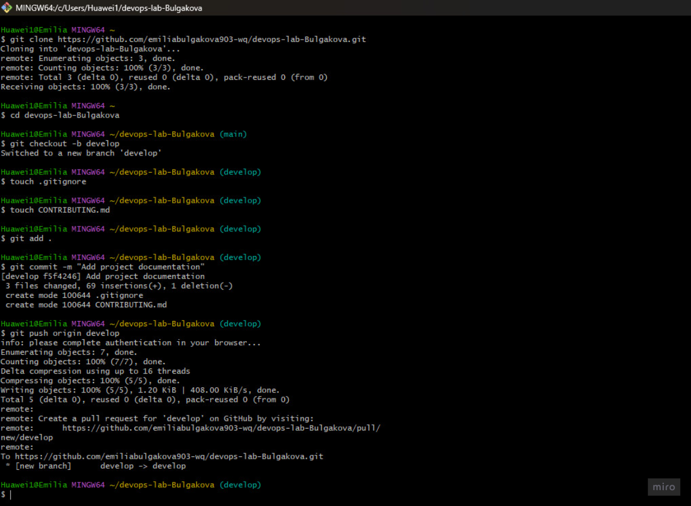
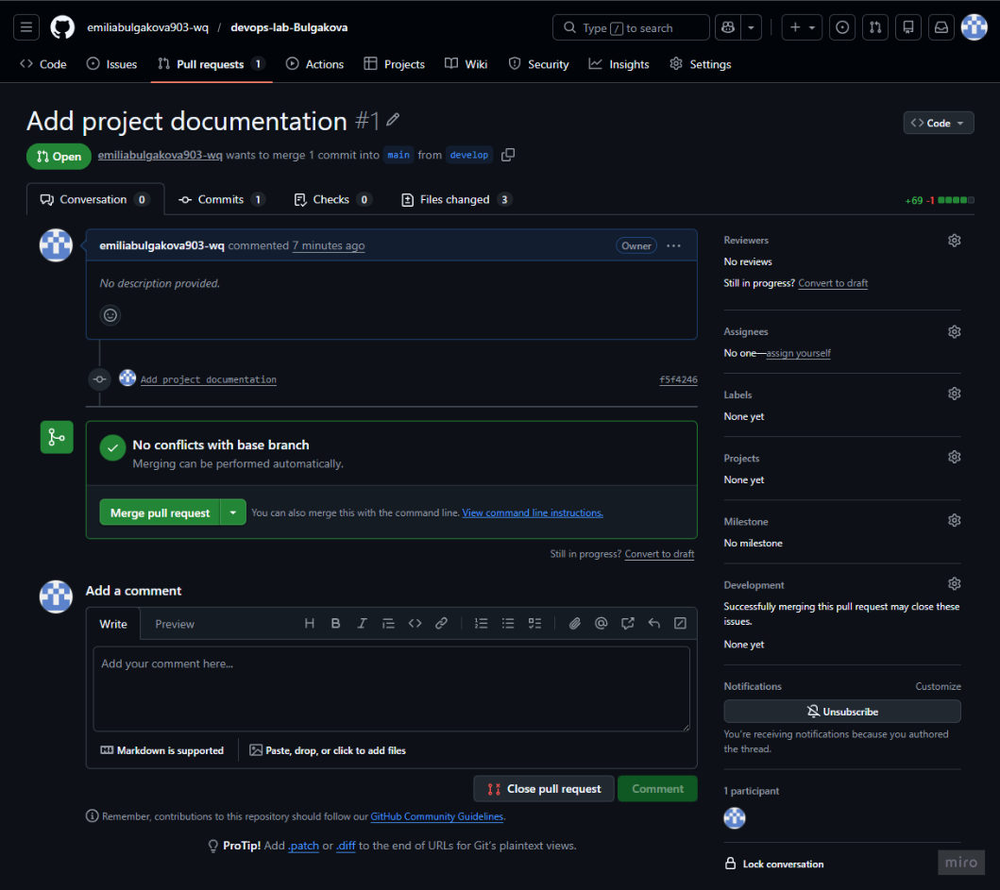
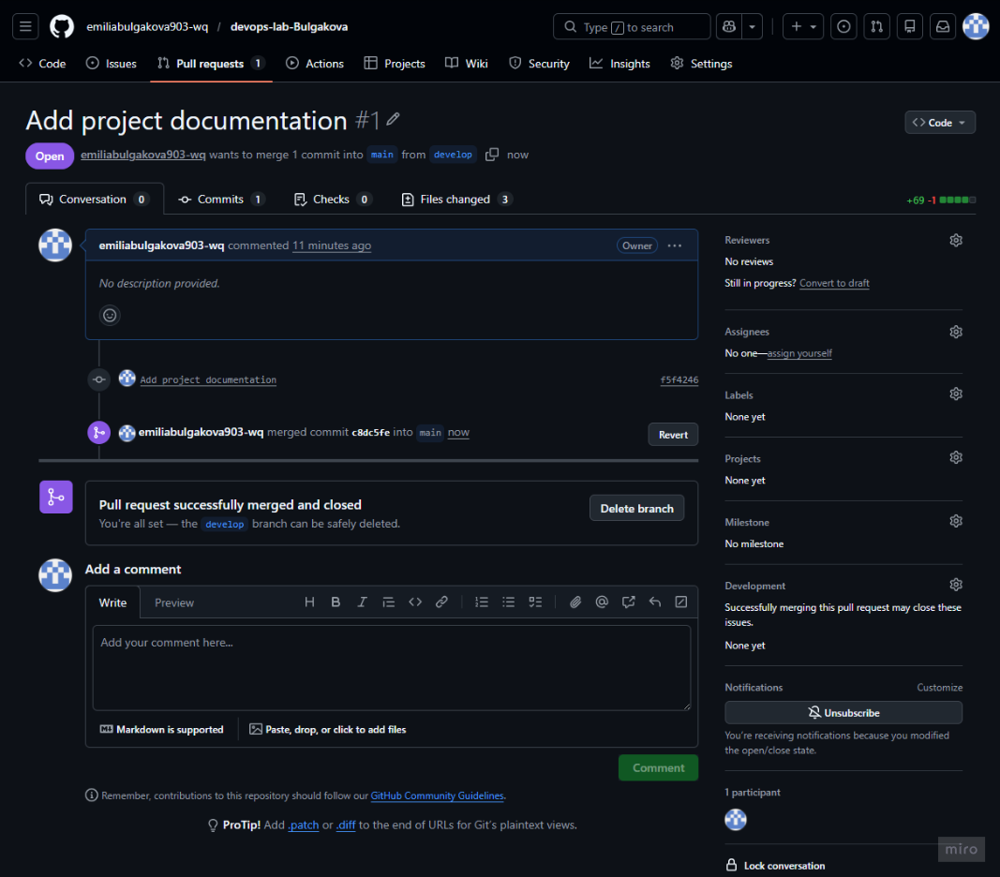
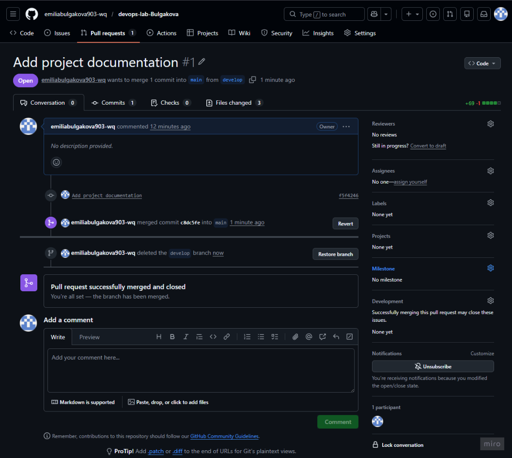

University: \\\[ITMO University](https://itmo.ru/ru/)

Faculty: \[FTMI](https://itmo.ru/ru/viewfaculty/87/fakultet\_tehnologicheskogo\_menedzhmenta\_i\_innovaciy.htm)

Course: \\\[Введение в веб технологии](https://itmo-ict-faculty.github.io/introduction-in-web-tech/)

Year: 2025/2026

Group: U4125

Author: Булгакова Емилия Валерьевна

Lab: Lab0

Date of create: 04.03.2026

Date of finished: 10.03.2026

Лабораторная работа №0: Подготовка окружения и работа с системой контроля версий Git

Цель работы: Установка необходимого программного обеспечения, создание репозитория на GitHub и освоение базовых команд Git (init, add, commit, push, merge).

Ход работы:

1\. Создан аккаунт и публичный репозиторий с корректным названием по формату ИТМО.

2\. Настройка локального окружения на ОС Windows.

3\. Подключение локальной папки к удаленному репозиторию на GitHub.

4\. Создание веток `main` и `develop`, выполнение первого слияния (merge).

5\. Добавлены файлы `.gitignore` (для исключения лишних файлов) и `LICENSE`.

Результат:

Настроенный и готовый к работе репозиторий со структурой папок для будущих лабораторных работ.

Выводы:

В ходе работы были освоены базовые принципы работы с Git, что необходимо для версионирования кода и совместной разработки проектов.

