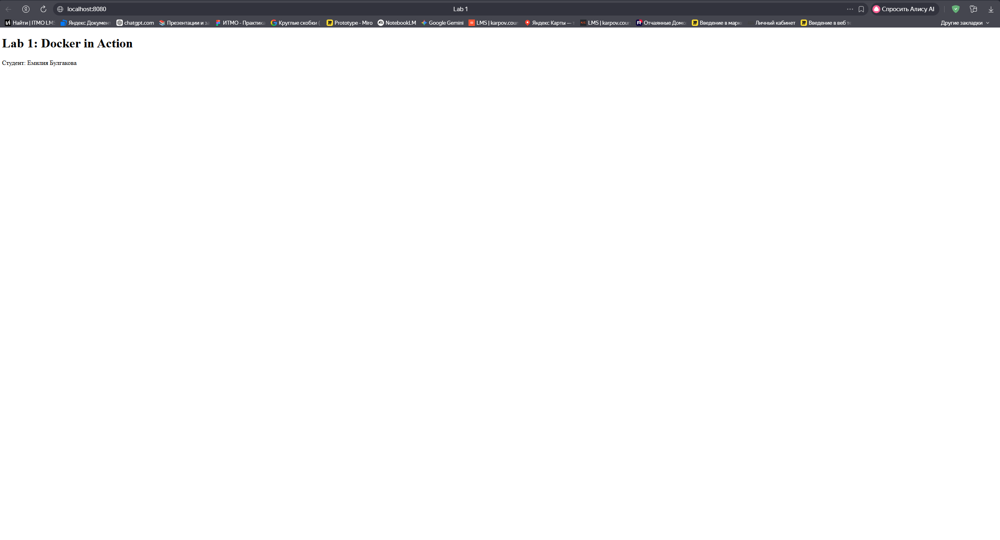
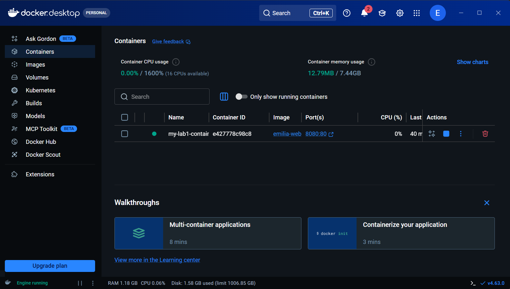

University: \[ITMO University](https://itmo.ru/ru/)

Faculty: [FTMI](https://itmo.ru/ru/viewfaculty/87/fakultet_tehnologicheskogo_menedzhmenta_i_innovaciy.htm)
Course: \[Введение в веб технологии](https://itmo-ict-faculty.github.io/introduction-in-web-tech/)

Year: 2025/2026

Group: U4125

Author: Булгакова Емилия Валерьевна

Lab: Lab1

Date of create: 10.03.2026

Date of finished: 10.03.2026

Лабораторная работа №1: Работа с Docker и контейнеризация статического сайта

Цель работы:

Ознакомиться с основами работы в Docker, научиться создавать собственные Docker-образы и запускать контейнеры на базе веб-сервера Nginx.

Ход работы:

1. Была выполнена настройка WSL и установлен Docker Desktop.

2. В репозитории создана отдельная ветка `lab1` и папка для файлов лабораторной работы.

3. Использован базовый образ `nginx:alpine` для минимизации размера контейнера.

4. Создан файл `index.html` с корректной кодировкой UTF-8 для отображения кириллицы.

5\. \

- Сборка образа: `docker build -t emilia-web-site ./lab1`

- Запуск контейнера: `docker run -d -p 8080:80 --name my-lab1-container emilia-web-site`

Результат:

Сайт успешно запущен внутри изолированного контейнера и доступен по адресу `localhost:8080`.

1. **Работа сайта в браузере (localhost:8080):**

**Запущенный контейнер в терминале (docker ps):**
