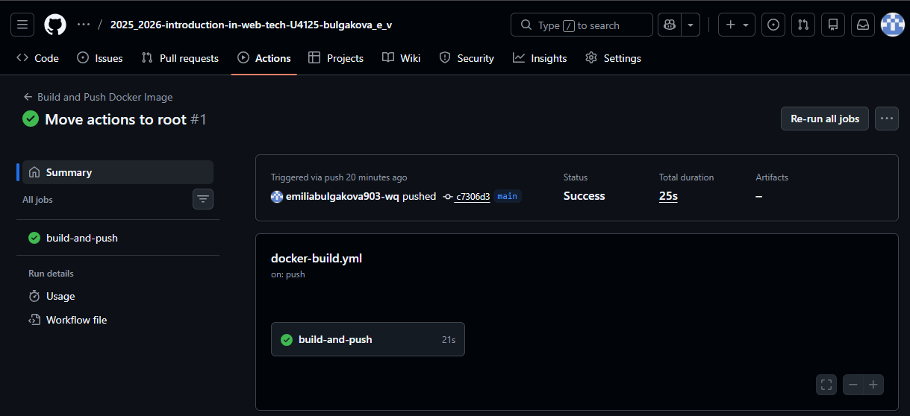

University: \[ITMO University](https://itmo.ru/ru/)

Faculty: [FTMI](https://itmo.ru/ru/viewfaculty/87/fakultet_tehnologicheskogo_menedzhmenta_i_innovaciy.htm)
Course: \[Введение в веб технологии](https://itmo-ict-faculty.github.io/introduction-in-web-tech/)

Year: 2025/2026

Group: U4125

Author: Булгакова Емилия Валерьевна

Lab: Lab2

Date of create: 16.03.2026

Date of finished: 16.03.2026

# Лабораторная работа №2: Настройка CI/CD пайплайна

**Цель работы:** Автоматизация сборки и публикации Docker-образа с помощью GitHub Actions.

**Ход работы:**
1. Создан аккаунт на Docker Hub и настроены Repository Secrets в GitHub (`DOCKER_USERNAME`, `DOCKER_PASSWORD`).
2. Разработан workflow-файл `.github/workflows/docker-build.yml`.
3. Настроен автоматический триггер на `push` в ветку `main`.
4. Пайплайн успешно выполняет:
   - Checkout кода;
   - Авторизацию в Docker Registry;
   - Сборку образа из папки `lab2`;
   - Push образа в Docker Hub.

**Результаты:**
- Ссылка на Docker Hub: https://hub.docker.com/repository/docker/emiliabulgakova/my-flask-app/general
- Пайплайн завершился успешно (статус Success).

